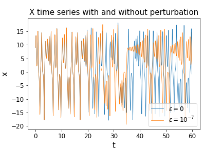
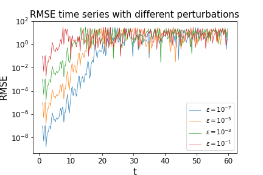
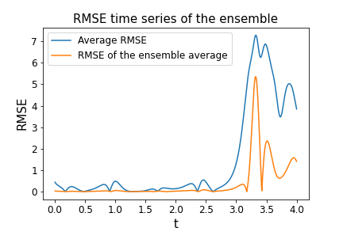

# The Lorenz system
The Lorenz system is a set of ordinary differential equations that describe the behavior of a forced dissipative hydrodynamic flow.
The equations are characterized by three parameters, (σ, b, r). When these parameters are set to specific values, they result in chaotic behavior in the system.

\quad\dot{y}=rx-xz-y\quad\dot{z}=xy-bz)

It is important to study the Lorenz system because it serves as a prime example of chaos theory, characterized by extreme sensitivity to initial conditions.

## Aim and idea of the code
The following code solves the problem of the integration of the Lorenz system to show its sensitivity of the system to initial conditionsIt also demonstrates how considering an ensemble of initial conditions can significantly reduce uncertainty about the system’s state. The numerical integration is performed using the Euler forward method. 
The study of sensitivity on initial conditions is done by perturbing the initial condition on the x variable with 4 predetermined perturbations,  ε = 1E-07, 1E-05, 1E-03 and 1E-01.Then, the system is numerically integrated, and at each time step, the code records the state of the x-variable and the mean square error relative to the unperturbed state.
For the ensemble the process is the same, but with 100 random perturbations, uniformly distributed between -
0.75 and 0.75. The time of integration is shorter for the ensemble to reduce the computation computational demand, but long enough to show the effect of the perturbation.

## Structure of the code
To execute the code, the user must download all files to the same directory. Then, the user should first launch the file [integration](https://github.com/LudovicoMattavelli/Lorenz-System-Perturbation-Impact/blob/main/lorenz.py), which will execute the integration and sensitivity analysis on the initial conditions of the case study as defined in the file [parameters](https://github.com/LudovicoMattavelli/Lorenz-System-perturbated-integration/blob/main/parameters.txt). The results are saved in the directory ***images***, which should be in the same directory as the other files.

The code is divided into five components:
- the file [parameters](https://github.com/LudovicoMattavelli/Lorenz-System-perturbed-integration/blob/main/parameters.txt) contains the values for the main parameters for the configuration of the case study. It's a txt file that is opened inside the main code.
- the file [lorenz](https://github.com/LudovicoMattavelli/Lorenz-System-perturbed-integration/blob/main/lorenz.py) contains the function used in the main code;
- the file [tests](https://github.com/LudovicoMattavelli/Lorenz-System-perturbed-integration/blob/main/tests.py) contains multiple tests for the function from [lorenz](https://github.com/LudovicoMattavelli/Lorenz-System-perturbed-integration/blob/main/lorenz.py) to check the correct behaviour of the function.
- the file [plot](https://github.com/LudovicoMattavelli/Lorenz-System-perturbed-integration/blob/main/plot.py) contains the functions to plot the three images of interest: 'X time series with and without perturbation', 'RMSE time series with different perturbations' and 'RMSE time series of the ensemble'.
- the file [integration](https://github.com/LudovicoMattavelli/Lorenz-System-perturbed-integration/blob/main/integration.py) contains the main part of the code. It first opens the file parameteres([parameters](https://github.com/LudovicoMattavelli/Lorenz-System-perturbed-integration/blob/main/parameters.txt)) and defines some variables necessary for the analysis; then, using the function from [lorenz](https://github.com/LudovicoMattavelli/Lorenz-System-perturbed-integration/blob/main/lorenz.py) it integrates in time all the variables of interest using the Euler forward method; at the end, after the integration, it plots three images using the functions defined inside [plot](https://github.com/LudovicoMattavelli/Lorenz-System-perturbed-integration/blob/main/plot.py).

## Results
Following the execution of the code, three images will be present inside ***images***. 

***Fig_X_time_series.png*** shows how even a very little perturbation on the initial condition can bring a big discrepancy with the unperturbated solution after some time. This means that the system has an extreme sensitivity to the initial condition, as expected for a system with chaotic behaviour.

***Fig_RMSE_time_series.png*** shows that the RMSE grows exponentially with time until a certain time different for every perturbation, where it stabilizes, while fluctuating. The time needed is longer if the perturbation is smaller.

***Fig_ensemble_RMSE_time_series.png*** shows how, after the sensitivity on the initial condition starts to
impact the evolution of the trajectories, the average of the ensemble is more precise than the average member of the
ensemble.

